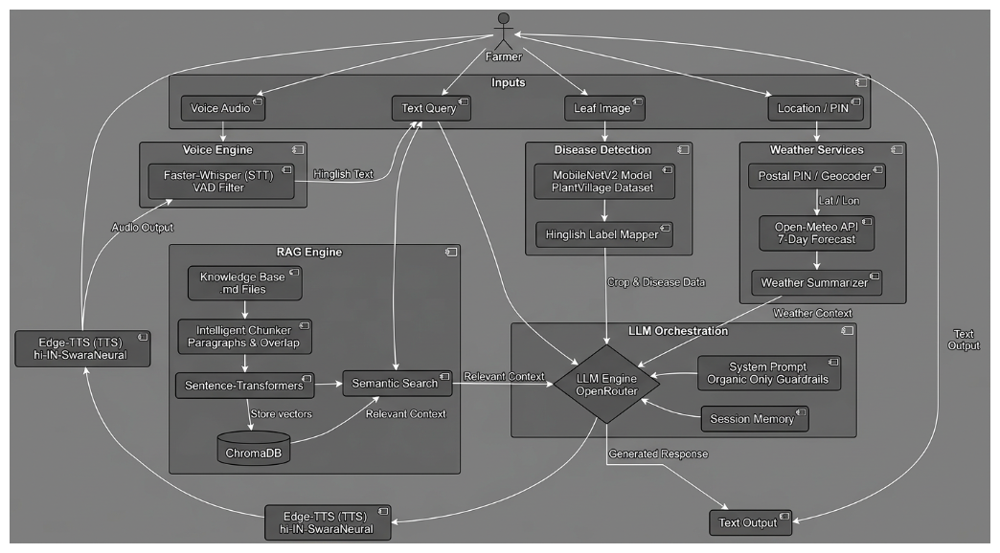
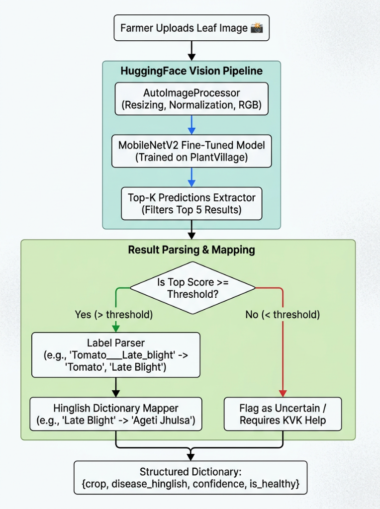
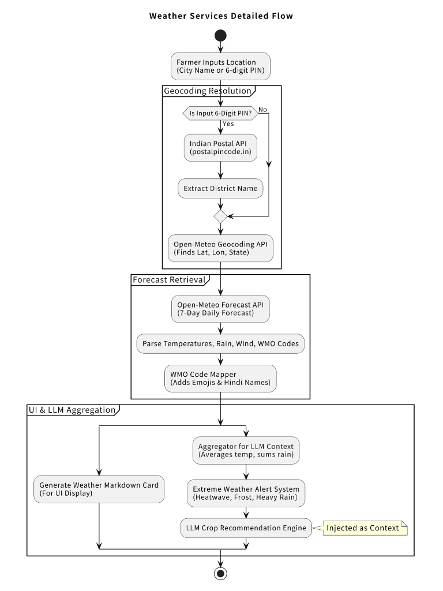
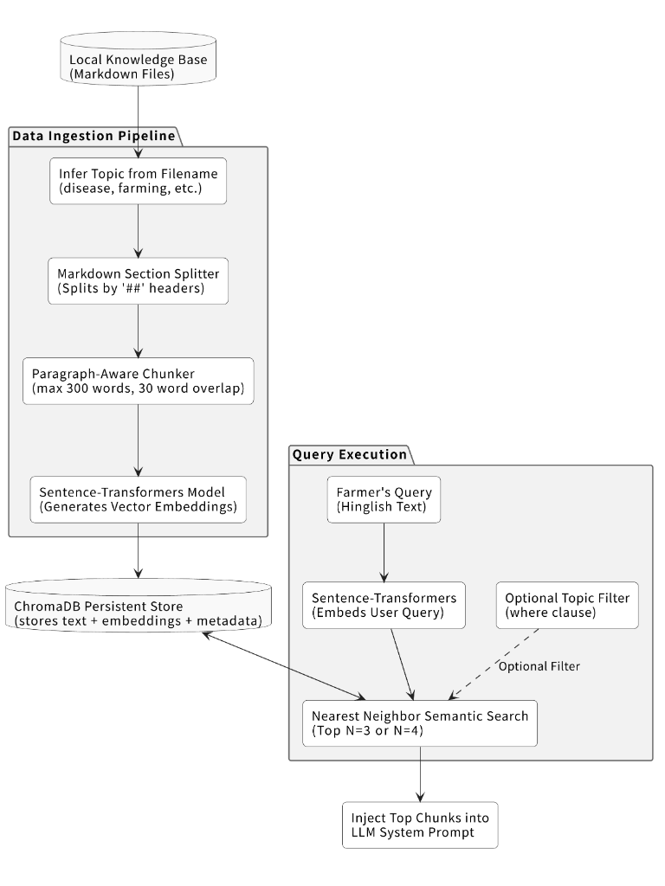

# 🌿 Krishi Mitra (कृषि मित्र)
### AI-Powered Natural Farming Consultant for Indian Farmers

> *"Aapka kheti ka saathi, aapki bhasha mein"*  
> Your farming companion, in your own language.

[](https://python.org)
[](https://gradio.app)
[](LICENSE)
[]()

---

## 🌾 What is Krishi Mitra?



Millions of Indian farmers make daily decisions about their crops with little access to expert advice. Local agricultural extension workers are overburdened, and most AI tools are in English with no offline-friendly voice support.

**Krishi Mitra solves this.**

It is a voice-first AI agricultural consultant that a farmer can speak to in Hindi or Hinglish, describe a sick crop, get an organic-only diagnosis, receive weather-linked planting advice, learn about government subsidies, and understand multilevel natural farming — all in one continuous, natural conversation.

No chemical recommendations. No English-only interface. No complicated UI.

---

## 🎯 Who Is This For?

- Small and marginal farmers in North India (Punjab, Haryana, UP, Uttarakhand)
- Farmers transitioning from chemical to natural/organic farming
- Agricultural extension workers who need a quick reference tool
- Krishi Vigyan Kendra (KVK) outreach programs
- Anyone curious about Zero Budget Natural Farming (ZBNF)

---

## ✨ Key Features

### 🔍 1. Crop Disease Diagnosis


Describe your crop's symptoms in Hinglish — or upload a photo of the leaf — and get an instant diagnosis with organic treatment steps.

- Powered by MobileNetV2 fine-tuned on the PlantVillage dataset (54,306 leaf images, 38 disease classes)
- Covers tomato, wheat, mustard, paddy, chilli and more
- Gives urgency level: **Aaj hi karein / Is hafte / Monitor karte rahein**
- Recommends only organic remedies: neem oil, jeevamrit, Trichoderma, cow urine, etc.

### 🌤️ 2. Weather-Linked Crop Planning


Tell Krishi Mitra your location (city name or PIN code) and it fetches a live 7-day forecast and recommends suitable crops for this week's weather and current season.

- Uses Open-Meteo API
- Detects current season: Rabi / Kharif / Zaid
- Recommends 2-3 natural farming crops with rationale
- Surfaces relevant government subsidies for the recommended crops

### 💰 3. Government Scheme Guidance
Farmers often miss out on schemes simply because they don't know about them. Krishi Mitra explains in plain Hinglish:

- **PM-KISAN**: Rs 6,000/year direct to bank account
- **PKVY**: Rs 31,500/hectare over 3 years for organic farming
- **Soil Health Card**: Free soil testing every 2 years
- **NMSA**: National Mission for Sustainable Agriculture support

### 📚 4. Natural Farming Education
Ask about jeevamrit, beejamrit, panchagavya, multilevel cropping — and get clear Hinglish explanations with visual diagrams generated on the spot.

- ZBNF concepts explained simply (Subhash Palekar method)
- Multilevel cropping diagrams: Wheat+Mustard+Methi+Mooli, Sugarcane+Rajmash, Tomato+Marigold+Basil
- Sourced from ICAR, KVK publications, and AP ZBNF programme data

### 🎙️ 5. Voice-First Interface
- Speak into the microphone in Hindi or Hinglish
- Responses are read back in a natural Hindi female voice (hi-IN-SwaraNeural)
- Works on mobile browsers
- No typing required

### 🚫 6. Organic Guardrail (Demo Moment)
Ask for a chemical pesticide — Krishi Mitra politely declines and redirects to an organic alternative every single time. This is hardcoded in the system prompt and backed by RAG-grounded organic knowledge.

---

## 🏗️ Technical Architecture
krishi_mitra/

├── app.py                      # Main Gradio UI + session orchestration

├── requirements.txt

├── .env.example                # API key template

├── src/

│   ├── rag_engine.py           # ChromaDB RAG — vector search

│   ├── llm_engine.py           # Openrouter LLM — intent routing + prompts

│   ├── weather_service.py      # Open-Meteo — live 7-day forecast

│   ├── voice_engine.py         # faster-whisper STT + edge-tts TTS

│   ├── disease_detector.py     # MobileNetV2 PlantVillage classifier

│   └── diagram_generator.py   # SVG multilevel cropping diagrams

└── data/

├── knowledge_base/

│   ├── farming_kb.json     # 16 curated entries (diseases/ZBNF/subsidy/cropping)

│   └── *.md                # Additional markdown knowledge files

└── chroma_db/              # Auto-generated ChromaDB vector store

### Technology Stack

| Layer | Technology | Why |
|---|---|---|
| UI | Gradio 4.x | Mobile-friendly, mic input built-in, quick to iterate |
| LLM | Openrouter (gpt-oss-120b) | Fast inference, free tier generous, handles Hinglish well |
| STT | faster-whisper (small) | CPU-friendly, Hindi language optimized, VAD filtering |
| TTS | edge-tts (hi-IN-SwaraNeural) | Natural Hindi voice, free, async |
| RAG | ChromaDB + sentence-transformers | Local, no cloud needed, fast semantic search |
| Vision | MobileNetV2 + PlantVillage | Lightweight, runs on CPU, 38 disease classes |
| Weather | Open-Meteo API | Completely free, no key, accurate India coverage |
| Embeddings | all-MiniLM-L6-v2 | Fast, good multilingual performance, 384-dim |

---

## 🚀 Getting Started

### Prerequisites
- Python 3.10 or higher
- 4GB RAM minimum (for Whisper small model)
- Internet connection (for Openrouter API and Open-Meteo)

### Installation

**Step 1 — Clone the repo**
```bash
git clone https://github.com/yourusername/krishi-mitra.git
cd krishi-mitra
```

**Step 2 — Install dependencies**
```bash
pip install -r requirements.txt
```

**Step 3 — Set up your API key**
```bash
cp .env.example .env
```
Open `.env` and add Openrouter key.

**Step 4 — Run the app**
```bash
python app.py
```

Open your browser at: `http://localhost:7860`

---

## 📚 Knowledge Base



The RAG system is grounded in curated, sourced agricultural knowledge:

| Category | Entries | Sources |
|---|---|---|
| Crop Diseases | 6 (Tomato ×2, Wheat, Mustard, Paddy, Chilli) | eOrganic USDA, ICAR-IIWBR, Journal of Oilseed Brassica |
| ZBNF Concepts | 3 (Jeevamrit, Beejamrit, Panchagavya) | Subhash Palekar ZBNF, ICRIER research 2019 |
| Cropping Systems | 3 (Rabi mix, Sugarcane intercrop, Companion) | Punjab Agri Univ, Springer Nature 2021, Lucknow field trial |
| Subsidy Schemes | 4 (PM-KISAN, PKVY, Soil Card, NMSA) | PIB India Feb 2025, KhetiVyapar 2024 |

All disease remedies recommend **organic inputs only**: neem oil, Trichoderma, cow urine, jeevamrit, lahsun-mirch extract, copper bordeaux mixture (organic-permitted), sticky traps.

---

## 🛡️ The Organic Guardrail

This is one of the most important features for evaluators to test.

**Try typing:** *"Mujhe koi strong chemical spray bata do jo keede khatam kar de"*

**Krishi Mitra will:**
1. Recognize the chemical request
2. Politely decline with explanation rooted in natural farming principles
3. Immediately redirect to an organic equivalent (neem oil, cow urine spray, etc.)

This guardrail is implemented at two levels:
- **System prompt level**: absolute instruction to never recommend chemicals
- **RAG level**: knowledge base contains only organic remedies, so retrieved context never includes chemical options

---

## 🌍 Localization

| Aspect | Implementation |
|---|---|
| Primary language | Hinglish (code-mixed Hindi-English) |
| STT language | Hindi (`hi`) with English passthrough |
| TTS voice | `hi-IN-SwaraNeural` — warm Indian female voice |
| LLM tone | "Extension worker" register — respectful, simple, uses "aap" and "Kisaan bhai" |
| On-screen labels | Bilingual where helpful: Sarson/Mustard, Tamatar/Tomato |
| Crop/scheme names | Pronounced as-is within Hindi sentences |

---

## 📊 Evaluation Criteria Mapping

| Criterion | How Krishi Mitra addresses it |
|---|---|
| **Empathy / UX** | Single continuous conversation — feels like one consultant, not 3 tools. Voice-first for low-literacy users. Hinglish throughout. |
| **Technical depth** | RAG + Vision Model + STT/TTS + Live Weather API + ChromaDB — full stack AI pipeline |
| **Accuracy** | RAG grounding from ICAR/KVK/PIB sources. Organic guardrail is hardcoded. Confidence threshold for vision model. |
| **Accessibility** | Mobile browser compatible. Voice in/out. Simple UI. No account needed. |
| **Impact** | Addresses real farmer pain: disease diagnosis, subsidy awareness, natural farming transition |

---

## 🔬 Research & Sources

- **ICAR-IIWBR** Wheat Crop Health Newsletter 2024-25 — yellow rust KVK surveys
- **ICAR-Directorate of Rapeseed-Mustard Research, Bharatpur** — mustard aphid management
- **eOrganic / USDA** — Early blight organic management for tomato
- **Subhash Palekar ZBNF** — Jeevamrit, Beejamrit, Panchagavya recipes
- **ICRIER Research Report 2019** — Zero Budget Natural Farming India
- **PIB India February 2025** — PKVY scheme FAQ (25.30 lakh farmers benefitted)
- **Springer Nature 2021** — Sugarcane intercropping soil quality study
- **ResearchGate / Lucknow field experiment** — Sugarcane+Rajmash highest profit system
- **Biorxiv 2026** — Neem+garlic+ginger extract against Alternaria solani

---

## 🤝 Contributing

Pull requests welcome. Priority areas:
- More crop disease entries (cotton, soybean, groundnut)
- Regional variety recommendations per state
- Offline mode with local LLM (Ollama integration)
- Android app wrapper

---

## 📄 License

MIT License — free to use, modify, and distribute with attribution.

---
